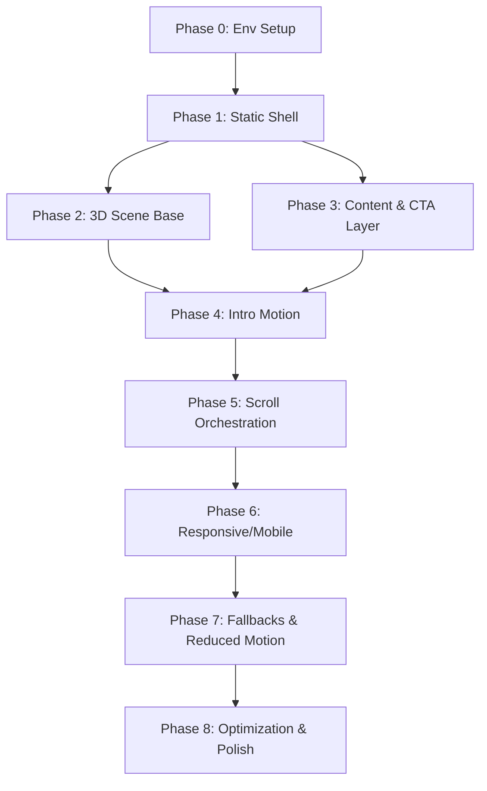

# HERO IMPLEMENTATION PLAYBOOK — Smart Pen Demo

**Project:** Smart Pen Premium Demo  
**Document Type:** Hero Implementation Playbook  
**Version:** 1.0  
**Date:** 2026-04-03  
**Purpose:** Task-by-task execution plan for AI agents with limited context windows

---

## 1. Executive Purpose

This playbook breaks the Smart Pen hero section implementation into **small, logically ordered, context-safe tasks** that an AI agent can execute incrementally — one task per session — without losing architectural consistency.

It is NOT implementation code. It is the **roadmap and execution structure** another agent will follow.

Each task is designed to be:
- executable independently within a short context window
- small enough to complete in one session
- validated before moving to the next task
- safe to pause and resume

---

## 2. Source of Truth

The implementing agent **MUST** consult these files before any task:

| Priority | File | Purpose |
|----------|------|---------|
| 🔴 Critical | `HERO_SPEC_smart_pen.md` | Creative direction, narrative, copy, visual rules |
| 🔴 Critical | `HERO_TECHNICAL_BUILD_PLAN_smart_pen.md` | Architecture, components, hooks, animation strategy |
| 🔴 Critical | `design-system.html` | Design tokens, colors, typography, components, motion |
| 🟡 Reference | `PRD_production.md` | Product vision, personas, user journey |
| 🟡 Reference | `TECH_SPEC_production.md` | Stack decisions, project structure |
| 🟡 Reference | `UI_SPEC_production.md` | UI/UX constraints |
| 🟡 Reference | `public/videos/animation.mp4` | Reference animation for motion direction |
| 🟢 Docs | `node_modules/next/dist/docs/` | Next.js 16 App Router specifics |

---

## 3. Global Build Rules

These rules are **non-negotiable** across all tasks:

### Design System Compliance
- Background: `#050a14` (page), glass panels with `rgba(255,255,255,0.03) + blur(16px)`
- Primary color: `#007bff`, gradient: `#007bff → #00bfff`
- Heading font: `Montserrat` (font-heading), Body: `Open Sans`
- Typography scale matches `design-system.html` exactly
- Glass panel pattern: `.glass-panel` with border hierarchy (top 0.15, sides 0.08, bottom 0.05)
- Buttons follow the primary/secondary patterns from design system

### Performance Rules
- Stable 60fps on good desktop hardware
- DPR capped at `1.5`–`2`
- Compressed textures, Draco/Meshopt for models
- No unnecessary post-processing
- `frameloop="demand"` when scene is static
- Never set React state on every frame/pointer tick — use `useRef` + `useFrame`
- Dynamic import R3F canvas with `ssr: false`

### Accessibility Rules
- Semantic heading hierarchy (`h1` only once)
- Keyboard-accessible CTAs with visible focus states
- Contrast-safe text over all backgrounds
- `prefers-reduced-motion` support is first-class, not afterthought

### Animation Ownership Rules
- **GSAP** owns: text entrance, CTA appearance, scroll progress mapping, DOM layer transitions
- **R3F/useFrame** owns: idle float, pointer parallax, smooth interpolation toward GSAP targets
- **Framer Motion** (optional): only small UI fades/button transitions NOT already handled by GSAP
- **ONE motion system per element** — never let GSAP and Framer Motion fight over same node

### Separation of Concerns
- 3D scene logic separate from DOM text/UI logic
- GSAP timelines isolated in hooks, not scattered in JSX
- Scene config values centralized in plain objects/constants
- No magic numbers scattered across files

### Mobile Fallback Rules
- Mobile does NOT compress desktop choreography
- Reduced/no 3D on mobile — use optimized video or still fallback
- CTA visible early, single column, no long scrub interactions
- Simplified motion, less scroll dependency

### Reduced Motion Support
- Disable scroll-linked scene choreography
- Remove idle float
- Make content immediately readable
- Preserve CTA prominence and hierarchy

### Code Quality
- TypeScript strict mode
- One responsibility per component
- Cleanup all GSAP timelines and ScrollTriggers on unmount
- Use `useGSAP` from `@gsap/react` (auto-cleanup via `gsap.context()`)
- Use `useRef` not `useState` for frame-level updates

---

## 4. Implementation Strategy

### Architecture: R3F + GSAP + Tailwind

```
┌─────────────────────────────────────────────┐
│ HeroSection (layout shell, responsive gate) │
│  ┌──────────────┐  ┌─────────────────────┐  │
│  │ HeroCanvas   │  │ HeroContent         │  │
│  │  └HeroScene  │  │  ├ Headline          │  │
│  │   ├ PenModel │  │  ├ Subheadline       │  │
│  │   ├ Lighting │  │  ├ HeroCTA           │  │
│  │   └ Camera   │  │  └ Trust microcopy   │  │
│  └──────────────┘  └─────────────────────┘  │
│  ┌──────────────┐  ┌─────────────────────┐  │
│  │ AmbientDets  │  │ HeroScrollCue       │  │
│  └──────────────┘  └─────────────────────┘  │
│  ┌──────────────────────────────────────┐   │
│  │ HeroFallback / HeroMobile (alt path) │   │
│  └──────────────────────────────────────┘   │
└─────────────────────────────────────────────┘
```

### Why This Architecture
- R3F gives premium 3D control over the pen as an interactive object
- GSAP gives precise cinematic timeline sequencing and scroll orchestration
- Tailwind provides rapid layout with design-system alignment
- Clean separation: Canvas renders product, DOM renders content
- Fallback path keeps experience premium even without WebGL

### GSAP ↔ R3F Bridge Pattern
- GSAP updates **target values** stored in mutable refs
- R3F scene **interpolates toward targets** in `useFrame` using lerp
- Result: smooth motion without jank from direct GSAP→three.js coupling

### Responsive Strategy
- **Desktop**: Full 3D + scroll narrative + pointer parallax
- **Tablet**: Reduced motion amplitude, simplified 3D reactions
- **Mobile**: One-column, reduced/no 3D, video/still fallback, CTA-first

---

## 5. Dependency Order



Key dependencies:
- Phase 1 must complete before anything visual
- Phase 2 and Phase 3 can proceed in parallel after Phase 1
- Phase 4 requires both 2 and 3
- All subsequent phases are strictly sequential

---

## 6. Phase Breakdown

| Phase | Name | Goal | Tasks |
|-------|------|------|-------|
| 0 | Prep & Environment | Validate stack, install deps, scaffold folders | T0.1–T0.3 |
| 1 | Static Hero Shell | Premium layout without any motion | T1.1–T1.4 |
| 2 | 3D Scene Base | Pen model rendered with premium lighting | T2.1–T2.5 |
| 3 | Content & CTA Layer | Text hierarchy, buttons, microcopy | T3.1–T3.3 |
| 4 | Intro Motion | Load choreography for scene + text | T4.1–T4.3 |
| 5 | Scroll Orchestration | ScrollTrigger narrative progression | T5.1–T5.3 |
| 6 | Responsive/Mobile | Tablet + mobile adaptation | T6.1–T6.3 |
| 7 | Fallbacks & Reduced Motion | Device capability tiers, a11y | T7.1–T7.3 |
| 8 | Optimization & Polish | Performance, cleanup, final tuning | T8.1–T8.4 |

---

## 7. Task Breakdown

### Phase 0 — Prep & Environment Validation

#### T0.1 — Install Hero Dependencies
- **Objective:** Add all required packages
- **Why:** Prevents missing-dependency errors mid-task
- **Prerequisites:** Project has `package.json` with Next.js 16, React 19, TailwindCSS 4
- **Files affected:** `package.json`, `bun.lock`
- **Implementation notes:**
  - Install: `three`, `@react-three/fiber`, `@react-three/drei`, `gsap`, `@gsap/react`
  - Optional: `@types/three`
  - Do NOT install Framer Motion yet
  - Do NOT install Lenis unless full site uses it
- **Libraries:** three, @react-three/fiber, @react-three/drei, gsap, @gsap/react
- **Acceptance criteria:** `bun install` succeeds; imports resolve
- **Common mistakes:** Installing too many deps; forgetting `@gsap/react`
- **Definition of done:** All deps installed, no import errors

#### T0.2 — Scaffold Hero File Structure
- **Objective:** Create folder/file skeleton per Technical Build Plan
- **Why:** Prevents ad-hoc file creation that drifts from architecture
- **Prerequisites:** T0.1
- **Files affected:** Multiple new files
- **Implementation notes:**
  - Create stubs for all components in `src/components/hero/` (HeroSection, HeroScene, HeroCanvas, HeroContent, HeroCTA, HeroAmbientDetails, HeroScrollCue, HeroFallback, HeroMobile)
  - Create hooks in `src/hooks/` (useHeroTimeline, useHeroScrollProgress, useReducedMotion, useDeviceCapabilities, useMediaQuery)
  - Create lib files in `src/lib/gsap/` (registerGsap), `src/lib/three/` (heroSceneConfig, heroLighting, heroMaterials, heroCamera), `src/lib/utils/` (lerp, clamp, rafThrottle)
  - Current project uses `src/app/` — adapt accordingly
  - Each file: minimal valid export (`export default function X() { return null; }`)
- **Acceptance criteria:** All files exist with valid TypeScript exports; project compiles
- **Common mistakes:** Wrong directory; forgetting `'use client'` on interactive components
- **Definition of done:** `bun run build` passes

#### T0.3 — Configure GSAP Registration & Utilities
- **Objective:** Set up GSAP plugin registration and shared utility functions
- **Why:** Centralizes setup, prevents duplicate registration
- **Prerequisites:** T0.1, T0.2
- **Files affected:** `src/lib/gsap/registerGsap.ts`, `src/lib/utils/lerp.ts`, `src/lib/utils/clamp.ts`
- **Implementation notes:**
  - `registerGsap.ts`: `gsap.registerPlugin(ScrollTrigger)`, export gsap
  - `lerp.ts`: `(start, end, factor) => start + (end - start) * factor`
  - `clamp.ts`: `(value, min, max) => Math.min(Math.max(value, min), max)`
- **Acceptance criteria:** Functions exported correctly; GSAP registered once
- **Common mistakes:** Registering inside a component instead of module-level
- **Definition of done:** Utils typed; registration triggers on import

---

### Phase 1 — Static Hero Shell

> **Checkpoint:** Hero looks premium with zero animation or 3D.

#### T1.1 — Design System Integration into Tailwind
- **Objective:** Map design-system tokens into Tailwind/CSS custom properties
- **Why:** All hero styling must use design system values
- **Prerequisites:** T0.2
- **Files affected:** `src/app/globals.css`
- **Implementation notes:**
  - CSS vars: `--color-bg: #050a14`, `--color-primary: #007bff`, etc.
  - Import Montserrat + Open Sans via `next/font/google`
  - TailwindCSS v4 uses `@theme inline` blocks — use that pattern
  - Define `.glass-panel` class matching design-system.html exactly (bg, backdrop-filter, border hierarchy, box-shadow, hover states, shimmer pseudo-element)
- **Acceptance criteria:** CSS variables available; glass-panel matches design system; fonts load
- **Common mistakes:** Using Tailwind v3 syntax; hardcoding colors
- **Definition of done:** Glass panel renders identically to design-system.html

#### T1.2 — Hero Layout Shell (HeroSection)
- **Objective:** Build full-viewport hero container with proper layering
- **Why:** Establishes spatial composition before content or 3D
- **Prerequisites:** T1.1
- **Files affected:** `src/components/hero/HeroSection.tsx`, marketing page
- **Implementation notes:**
  - `h-screen`, `relative`, `overflow-hidden`
  - z-index layers: bg(0) → canvas(1) → content(10) → ambient(15) → scroll cue(20)
  - Dark background using `--color-bg`
  - `'use client'` component
  - Subtle gradient overlay at bottom for depth
  - Integrate into marketing page route (`src/app/(marketing)/page.tsx` or `src/app/page.tsx`)
- **Acceptance criteria:** Hero fills viewport; dark bg; layers stack correctly
- **Common mistakes:** Fixed height vs viewport units; z-index conflicts with nav
- **Definition of done:** Empty dark hero section renders full-viewport

#### T1.3 — Placeholder Product Area
- **Objective:** Reserve 3D canvas area with temporary visual placeholder
- **Why:** Validates spatial composition before real 3D exists
- **Prerequisites:** T1.2
- **Files affected:** `src/components/hero/HeroSection.tsx`
- **Implementation notes:**
  - Centered placeholder (gradient circle or glass-panel div)
  - Position: centered, slightly offset vertically per spec
  - Will be replaced by `HeroCanvas` in Phase 2
- **Acceptance criteria:** Placeholder visible, properly centered, composition feels balanced
- **Definition of done:** Layout reads as "premium dark hero with centered product area"

#### T1.4 — Noise Overlay and Ambient Background
- **Objective:** Add film-grain noise overlay and liquid blob ambient elements
- **Why:** Creates premium atmospheric depth from design system
- **Prerequisites:** T1.2
- **Files affected:** `src/components/hero/HeroSection.tsx`
- **Implementation notes:**
  - Noise: `fixed`, `opacity: 0.04`, `mix-blend-mode: overlay`, SVG noise
  - Liquid blobs: `blur(80px)`, primary blue + purple + cyan, `pointer-events: none`
  - Match blob config from design-system.html (sizes, positions, animation durations: 15s, 20s, 25s)
- **Acceptance criteria:** Subtle grain visible; blobs create soft ambient light; no perf issues
- **Definition of done:** Background atmosphere matches design system

---

### Phase 2 — 3D Scene Base

> **Checkpoint:** Pen renders with premium silhouette and lighting. Static, no animation.

#### T2.1 — R3F Canvas Integration (HeroCanvas)
- **Objective:** Mount React Three Fiber canvas into hero layout
- **Why:** Canvas must be properly configured before loading 3D content
- **Prerequisites:** T1.2, T0.1
- **Files affected:** `src/components/hero/HeroCanvas.tsx`, `src/components/hero/HeroSection.tsx`
- **Implementation notes:**
  - `'use client'` component; use `next/dynamic` with `ssr: false` when imported into page
  - Canvas props: `dpr={[1, 1.5]}`, `gl={{ antialias: true, alpha: true }}`, camera from heroSceneConfig
  - `<Suspense>` wrapper with loading fallback
  - `style={{ position: 'absolute', inset: 0 }}` to fill hero area
  - Transparent canvas so CSS background shows through
  - Replace T1.3 placeholder with this canvas
- **Libraries:** @react-three/fiber
- **Acceptance criteria:** Canvas mounts without SSR errors; transparent bg; no console errors
- **Common mistakes:** Forgetting `ssr: false`; opaque canvas background; wrong camera FOV
- **Definition of done:** Empty canvas visible in hero

#### T2.2 — Scene Configuration Constants
- **Objective:** Define tunable 3D scene values in centralized config
- **Why:** Prevents magic numbers; makes tuning easy
- **Prerequisites:** T0.2
- **Files affected:** `src/lib/three/heroSceneConfig.ts`
- **Implementation notes:**
  - Camera: `position [0, 0.2, 4]`, `fov: 30`
  - Pen: position `[0,0,0]`, rotation `[0.15, 0.4, 0]`, idle amplitudes 0.04/0.03
  - Lighting: key `[3,2,4] @ 1.6`, fill `[-2,1,2] @ 0.6`, rim `[0,2,-3] @ 0.8`
  - Scroll: rotation range 15°, camera shift 0.3
  - All typed with `as const` for tuple inference
- **Acceptance criteria:** Config exports typed object
- **Definition of done:** Single config file, all scene components import from here

#### T2.3 — Pen Model Loading (HeroScene)
- **Objective:** Load and display pen 3D model
- **Why:** Pen is the absolute focal point
- **Prerequisites:** T2.1, T2.2
- **Files affected:** `src/components/hero/HeroScene.tsx`
- **Implementation notes:**
  - `useGLTF` from drei; if no `.glb` model yet, use temporary capsule geometry as placeholder
  - Position/rotation from config
  - PBR materials (`MeshStandardMaterial` or `MeshPhysicalMaterial`)
  - `useGLTF.preload('/models/smart-pen.glb')` outside component tree
- **Libraries:** @react-three/drei (useGLTF)
- **Acceptance criteria:** Pen renders centered; silhouette clean and legible
- **Definition of done:** Pen visible with correct position from config

#### T2.4 — Lighting Rig
- **Objective:** Three-point lighting for premium product presentation
- **Why:** Lighting defines perceived quality more than geometry
- **Prerequisites:** T2.3
- **Files affected:** `src/components/hero/HeroScene.tsx`
- **Implementation notes:**
  - Key (dominant spotlight/directional), Fill (soft ambient), Rim (back, silhouette edge) — positions from config
  - Optional `<Environment preset="studio" />` from drei for subtle reflections
  - Optional `<ContactShadows>` for subtle grounding effect
  - Tone: luxury hardware ad — NOT gaming RGB or flat e-commerce
  - Avoid too many lights, overblown highlights, unrealistic shine
- **Libraries:** @react-three/drei (Environment, ContactShadows)
- **Acceptance criteria:** Pen looks premium; silhouette defined; materials read as high-end
- **Definition of done:** Static pen screenshot looks like a product advertisement

#### T2.5 — Camera Setup
- **Objective:** Perspective camera with premium framing
- **Why:** Camera angle is critical to "expensive" product feel
- **Prerequisites:** T2.3
- **Files affected:** `src/components/hero/HeroCanvas.tsx`
- **Implementation notes:**
  - FOV ~30 (tight, cinematic — not wide-angle distortion)
  - Position from config; slight angle, not perfectly flat
  - Large negative space around pen (per spec composition rules)
  - No orbit controls in production
  - Store camera ref for later Phase 4/5 animation access
- **Acceptance criteria:** Pen framed elegantly; composition breathes; angle intentional
- **Definition of done:** Premium camera composition that makes pen look desirable

---

### Phase 3 — Content & CTA Layer

> **Checkpoint:** Text and CTAs render correctly over/beside 3D scene.

#### T3.1 — HeroContent (Headline + Subheadline)
- **Objective:** Render hero text layer with proper typography
- **Why:** Copy must be impactful regardless of 3D state
- **Prerequisites:** T1.1, T1.2
- **Files affected:** `src/components/hero/HeroContent.tsx`
- **Implementation notes:**
  - h1: `text-6xl md:text-8xl lg:text-9xl font-semibold leading-[0.85] tracking-tight`, Montserrat
  - Subheadline: `text-lg md:text-xl text-gray-300/80 font-light leading-relaxed max-w-lg`
  - Recommended copy (Version A): "The pen, reimagined." / "A premium writing experience designed around precision, focus, and a new intelligent layer of control."
  - Use `split-line` spans for future text-reveal animation (structure now, animate Phase 4)
  - z-index 10+ (above canvas layer)
  - Must maintain contrast over dark background at all times
- **Acceptance criteria:** Text readable; hierarchy clear; h1 only once; responsive sizing works
- **Definition of done:** Premium headline + subheadline at all breakpoints

#### T3.2 — HeroCTA Component
- **Objective:** Primary and secondary CTA buttons with trust microcopy
- **Why:** CTA is the conversion goal — must be visually dominant
- **Prerequisites:** T3.1
- **Files affected:** `src/components/hero/HeroCTA.tsx`
- **Implementation notes:**
  - Primary: "Join the Private Beta" — `bg-[#007bff] text-white text-xs font-semibold uppercase tracking-widest py-3 px-8 rounded-xl`, hover inverts to white bg
  - Secondary: "Watch the Experience" — glass-panel secondary button style
  - Trust microcopy below: "Limited early access to the demo system." — `text-xs text-gray-500`
  - Keyboard accessible: visible focus states, proper semantic elements
  - CTA row: flex, centered, gap between buttons
  - Button hover: 120ms-180ms transition, slight scale/elevation — no flashy glow
- **Acceptance criteria:** Primary CTA dominant; hover smooth; keyboard accessible; focus states visible
- **Definition of done:** CTA pair with correct hierarchy, hover states, microcopy

#### T3.3 — HeroScrollCue
- **Objective:** Subtle scroll indicator at hero bottom
- **Why:** Guides user without stealing focus
- **Prerequisites:** T1.2
- **Files affected:** `src/components/hero/HeroScrollCue.tsx`
- **Implementation notes:**
  - Position: absolute bottom-center
  - Text: "Scroll Down" — `text-[10px] uppercase tracking-[0.2em] text-gray-500`
  - Visual: thin gradient line `bg-gradient-to-b from-[#007bff] to-transparent`, 1px wide, 48px tall
  - Match design-system.html hero scroll cue exactly
- **Acceptance criteria:** Visible but subordinate; matches design system
- **Definition of done:** Subtle scroll hint at bottom

---

### Phase 4 — Intro Motion

> **Checkpoint:** Page load feels polished with intentional entrance choreography.

#### T4.1 — GSAP Intro Timeline (useHeroTimeline)
- **Objective:** Create GSAP timeline for page-load animation
- **Why:** Centralizes intro animation in one cleanable hook
- **Prerequisites:** T0.3, T3.1, T3.2
- **Files affected:** `src/hooks/useHeroTimeline.ts`
- **Implementation notes:**
  - Use `useGSAP` from `@gsap/react` — NOT raw `useEffect`
  - Pass container ref as `scope` to auto-scope selectors
  - Sequence: scene fade(0.8s) → headline translateY reveal(stagger 80ms) → sub fade+slide(0.6s) → CTA(0.5s) → scroll cue(0.4s)
  - Easing: `power2.out` or custom premium curve
  - Total: ~2-3s max
  - Timing from spec: UI entrance 0.5s–0.9s, text stagger 60ms–120ms
- **Libraries:** gsap, @gsap/react
- **Acceptance criteria:** Clean entrance; no FOUC; cleanup on unmount
- **Common mistakes:** Too fast/aggressive; forgetting cleanup; running before DOM ready
- **Definition of done:** Smooth premium intro plays once on load

#### T4.2 — 3D Scene Idle Motion
- **Objective:** Subtle idle float and rotational drift on pen
- **Why:** Makes product feel alive without user interaction
- **Prerequisites:** T2.3
- **Files affected:** `src/components/hero/HeroScene.tsx`
- **Implementation notes:**
  - `useFrame` with `delta` for frame-rate independence
  - Y float: `sin(time) * 0.04`; rotation drift: `sin(time * 0.7) * 0.03`
  - Nearly invisible — "is the pen moving?" level subtlety
  - `useRef` for mesh — never `useState` for per-frame values
  - Skip if `prefers-reduced-motion` is true
- **Acceptance criteria:** Pen floats subtly; barely perceptible; no jank
- **Common mistakes:** Too much amplitude; arcade floating; not using delta
- **Definition of done:** Barely-perceptible idle life

#### T4.3 — Pointer Parallax
- **Objective:** Camera/pen reacts subtly to mouse for depth perception
- **Why:** Premium interactive feel without requiring scroll
- **Prerequisites:** T2.5, T4.2
- **Files affected:** `src/components/hero/HeroScene.tsx`
- **Implementation notes:**
  - Track normalized pointer position (-1 to 1 on both axes)
  - Apply very slight rotation/position offset (~2-3° max)
  - Lerp to interpolate — never snap
  - Read stored pointer position in `useFrame` — never setState on pointermove
  - Disable on mobile; disable if reduced motion
- **Acceptance criteria:** Subtle depth on pointer move; smooth interpolation; no lag
- **Common mistakes:** Too much movement; snappy response; causing React re-renders
- **Definition of done:** Barely-visible parallax depth

---

### Phase 5 — Scroll Orchestration

> **Checkpoint:** Scroll deepens experience with narrative progression.

#### T5.1 — useHeroScrollProgress Hook
- **Objective:** Map scroll to normalized 0→1 progress value
- **Why:** All scroll effects reference this single source
- **Prerequisites:** T0.3
- **Files affected:** `src/hooks/useHeroScrollProgress.ts`
- **Implementation notes:**
  - GSAP ScrollTrigger on hero section element
  - Start: `"top top"`, End: `"bottom top"` or `"+=100%"`
  - Store progress in `useRef` — not state (avoids re-renders)
  - `scrub: true` for smooth linking
  - NO pinning unless carefully tested — avoid trapping user
- **Acceptance criteria:** Progress 0→1 smooth; no jank; no re-renders
- **Definition of done:** Scroll progress ref updates smoothly

#### T5.2 — Scroll-Linked 3D Transforms
- **Objective:** Rotate pen and shift camera based on scroll progress
- **Why:** Deepens the scene and suggests product intelligence
- **Prerequisites:** T5.1, T2.3
- **Files affected:** `src/components/hero/HeroScene.tsx`
- **Implementation notes:**
  - Read scroll progress ref in `useFrame`
  - Pen rotates 5-15° across full scroll range
  - Slight camera position shift for parallax
  - Lerp for buttery-smooth interpolation
  - Hero MUST look excellent at scroll=0 (no dependency on scrolling)
  - GSAP sets target values → R3F interpolates in useFrame
- **Acceptance criteria:** Gentle rotation; subtle camera shift; no stutter
- **Definition of done:** Smooth scroll-linked 3D progression

#### T5.3 — Scroll-Linked Content Transitions
- **Objective:** Subtle text emphasis changes as user scrolls
- **Why:** Reinforces narrative progression (Arrival → Reveal → Invitation)
- **Prerequisites:** T5.1, T3.1
- **Files affected:** `src/hooks/useHeroTimeline.ts`, `src/components/hero/HeroContent.tsx`
- **Implementation notes:**
  - Headline may fade/compress slightly on scroll
  - Secondary copy/microcopy may appear
  - CTA emphasis increases — beta invitation becomes stronger
  - CTA always accessible — never hidden during scroll
  - All transitions are optional enhancements, not required for understanding
- **Acceptance criteria:** Content evolves subtly; CTA prominent; no jarring transitions
- **Definition of done:** Narrative visible on scroll; hero works without scrolling

---

### Phase 6 — Responsive/Mobile

> **Checkpoint:** Hero works across all devices.

#### T6.1 — useMediaQuery and useDeviceCapabilities
- **Objective:** Detect viewport size and device capability
- **Prerequisites:** T0.2
- **Files affected:** `src/hooks/useMediaQuery.ts`, `src/hooks/useDeviceCapabilities.ts`
- **Implementation notes:**
  - `useMediaQuery`: wraps `window.matchMedia`, returns boolean for breakpoints (md:768, lg:1024)
  - `useDeviceCapabilities`: checks DPR, `navigator.hardwareConcurrency`, `navigator.deviceMemory`; returns tier (high/medium/low)
  - Both SSR-safe (return defaults during server render)
  - `'use client'` directive required
- **Acceptance criteria:** Correct values; SSR-safe; update on resize
- **Definition of done:** Hooks identify device tier and viewport

#### T6.2 — Responsive Layout Adjustments
- **Objective:** Adapt hero layout for tablet and mobile
- **Prerequisites:** T6.1, T1.2, T3.1
- **Files affected:** `src/components/hero/HeroSection.tsx`, `HeroContent.tsx`
- **Implementation notes:**
  - Mobile: shorter hero, stacked text, single CTA emphasis, hide/deprioritize secondary CTA
  - Tablet: maintain layout, reduce spacing
  - Text sizing already responsive via Tailwind (`text-6xl md:text-8xl lg:text-9xl`)
  - CTA visible without scrolling on mobile
  - Consider `HeroMobile` component for small screens
- **Acceptance criteria:** Hero intentional at 375px, 768px, 1024px, 1440px
- **Definition of done:** Hero correct at all breakpoints

#### T6.3 — Mobile Scene Reduction
- **Objective:** Simplify or replace 3D on mobile
- **Prerequisites:** T6.1, T2.1
- **Files affected:** `src/components/hero/HeroSection.tsx`, `HeroMobile.tsx`
- **Implementation notes:**
  - Conditionally render `HeroMobile` instead of `HeroCanvas` on mobile
  - Options: video loop from `public/videos/animation.mp4`, static image, or very simplified 3D
  - If video: short loop, muted, autoplay, `playsInline`, optimized compression
  - Same text/CTA layer on top — only product visual changes
  - Gate on `useMediaQuery` and/or `useDeviceCapabilities`
- **Acceptance criteria:** Mobile loads fast; product prominent; no WebGL errors on weak devices
- **Definition of done:** Mobile hero feels intentional, not broken desktop

---

### Phase 7 — Fallbacks & Reduced Motion

> **Checkpoint:** Experience degrades gracefully across all conditions.

#### T7.1 — useReducedMotion Hook
- **Objective:** Detect `prefers-reduced-motion` user preference
- **Prerequisites:** T0.2
- **Files affected:** `src/hooks/useReducedMotion.ts`
- **Implementation notes:**
  - `window.matchMedia('(prefers-reduced-motion: reduce)')`
  - Return boolean, update on change; SSR-safe (default `false`)
- **Acceptance criteria:** Correct value; updates if preference toggles
- **Definition of done:** Hook detects reduced motion

#### T7.2 — Reduced Motion Integration
- **Objective:** Disable animations when reduced motion preferred
- **Prerequisites:** T7.1, T4.1, T4.2, T5.1
- **Files affected:** HeroScene, useHeroTimeline, useHeroScrollProgress, HeroContent
- **Implementation notes:**
  - Disable: idle float, pointer parallax, scroll-linked 3D, text stagger
  - Content immediately visible; CTA immediately visible; product static premium pose
  - Pass `reducedMotion` boolean through to all animation consumers
- **Acceptance criteria:** Static, premium, fully readable, CTA prominent
- **Definition of done:** Reduced motion hero indistinguishable from intentional premium static design

#### T7.3 — HeroFallback (Tier 3)
- **Objective:** Non-WebGL fallback for unsupported devices
- **Prerequisites:** T6.3
- **Files affected:** `src/components/hero/HeroFallback.tsx`
- **Implementation notes:**
  - Detect WebGL support (try creating canvas context)
  - If no WebGL: high-quality static image or `<video>` of pen
  - Same text/CTA layer; must feel intentional, not broken
  - Can share implementation approach with `HeroMobile`
- **Acceptance criteria:** No WebGL errors; looks premium; CTA works
- **Definition of done:** Fallback visually cohesive and conversion-ready

---

### Phase 8 — Optimization & Polish

> **Checkpoint:** Production-ready, performant, premium hero.

#### T8.1 — Performance Profiling
- **Objective:** Profile and optimize render performance
- **Prerequisites:** All prior phases
- **Implementation notes:**
  - Chrome DevTools Performance tab: FPS during scroll, idle CPU, memory, TTI
  - Fix: texture resolution, antialias toggle, DPR, light count
  - Check layout thrashing, memory leaks from timelines/listeners
  - Consider `<PerformanceMonitor>` from drei for dynamic quality
- **Acceptance criteria:** 60fps mid-range desktop; no stutter; no leaks
- **Definition of done:** Performance verified on 2+ device classes

#### T8.2 — Asset Optimization
- **Objective:** Optimize model, textures, media
- **Prerequisites:** T2.3
- **Implementation notes:**
  - Draco/Meshopt GLB compression; KTX2 textures if beneficial
  - Video fallback: H.264, ≤2MB, short loop
  - Preload hero only; lazy-load everything below fold
- **Acceptance criteria:** Hero payload under budget; model loads <2s on 3G
- **Definition of done:** Optimized assets with verified visual quality

#### T8.3 — Code Cleanup
- **Objective:** Clean code, verify code splitting
- **Prerequisites:** All prior phases
- **Implementation notes:**
  - Remove dev tools (Leva, r3f-perf) from production
  - Verify hero scene dynamically imported (code split)
  - Verify all GSAP contexts revert on unmount
  - Remove dead code, unused imports, debug logs
  - TypeScript strict compliance check
- **Acceptance criteria:** Clean build; no warnings; appropriate bundle size
- **Definition of done:** Production-ready codebase

#### T8.4 — Final Visual Polish
- **Objective:** Fine-tune for maximum impact
- **Prerequisites:** All prior phases
- **Implementation notes:**
  - Review against HERO_SPEC 7 success criteria:
    1. Users immediately understand it is premium
    2. Product feels desirable within 3 seconds
    3. CTA feels natural and strong
    4. Page remains smooth
    5. Hero works with motion reduced
    6. Pen is emotional center
    7. User wants to scroll or click CTA
  - Tune: timing, easing, light intensity, materials, copy sizing
  - Compare against Apple-like restraint benchmarks
- **Acceptance criteria:** Hero meets all 7 spec success criteria
- **Definition of done:** Ship-ready premium hero

---

## 8. Context-Safe Execution Guidance

1. **Each task is self-contained.** Read only current task + prerequisites' files.
2. **Each task fits in one session.** If too large, split — never combine tasks.
3. **Restate local context before coding.** Read relevant source files and task block.
4. **Do not rewrite unrelated parts.** Only touch files listed in "files affected."
5. **Preserve prior architecture.** Never change component boundaries or hook signatures from earlier tasks.
6. **Fetch library docs if uncertain.** Check GSAP, R3F, drei docs rather than guessing.
7. **Stop after one task.** Complete, validate, summarize — then stop.

---

## 9. Recommended Task Size

- **Ideal:** 50–150 lines changed per task
- **Maximum:** 200 lines across ≤3 files
- **If >200 lines:** split into sub-tasks
- **Each task:** 10–20 minutes focused work
- **Each task produces:** a verifiable, testable increment

---

## 10. Session Workflow

1. **Read** current task block from this playbook
2. **Read** only files in "prerequisites" and "files affected"
3. **Read** relevant design-system/spec sections if referenced
4. **Fetch** library docs if unfamiliar API usage
5. **Implement** only current task
6. **Validate** against acceptance criteria
7. **Stop** and summarize what was done, changed, and any issues

---

## 11. Validation Checkpoints

| Phase | Checkpoint |
|-------|-----------|
| 0 | `bun run build` passes; all deps installed; stubs compile |
| 1 | Hero fills viewport; dark bg; fonts load; glass-panel matches DS |
| 2 | Pen renders premium silhouette; screenshot = product advertisement |
| 3 | Text readable; CTA clear; keyboard accessible; responsive type |
| 4 | Intro plays once; intentional feel; no FOUC; cleanup verified |
| 5 | Scroll deepens scene; no stutter; hero works without scrolling |
| 6 | Hero intentional at 375px / 768px / 1024px / 1440px |
| 7 | Reduced motion: premium static hero; Fallback: no WebGL errors |
| 8 | 60fps; clean build; all 7 spec success criteria met |

---

## 12. Risk Areas

| Risk | Likelihood | Impact | Mitigation |
|------|-----------|--------|-----------|
| Over-animation | High | Breaks premium feel | Start static, add gradually; amplitude ≤50% of instinct |
| Scroll jank | High | Destroys immersion | Lerp interpolation; never setState on scroll; profile early |
| Poor mobile | High | Loses conversions | Mobile as separate path, not compressed desktop |
| Too much in one task | High | Context overflow | Follow breakdown; split if >200 lines |
| Mixed animation ownership | Medium | Conflicting motion | One system per element; document ownership |
| Weak fallback | Medium | Broken experience | Treat fallback as designed product |
| Poor assets | Medium | Slow load, thermal | Compress early; DPR cap; lazy-load |
| GSAP↔R3F jank | Medium | Jerky 3D | Target-ref bridge: GSAP sets targets, R3F lerps |

---

## 13. Suggested Task Sequence

```
T0.1 → T0.2 → T0.3
  → T1.1 → T1.2 → T1.3 → T1.4
    → T2.1 → T2.2 → T2.3 → T2.4 → T2.5
    → T3.1 → T3.2 → T3.3
      → T4.1 → T4.2 → T4.3
        → T5.1 → T5.2 → T5.3
          → T6.1 → T6.2 → T6.3
            → T7.1 → T7.2 → T7.3
              → T8.1 → T8.2 → T8.3 → T8.4
```

Phase 2 and 3 may interleave after Phase 1. All others sequential.
**Total: 30 tasks across 9 phases.**

---

## 14. Agent Operating Rules

1. **Never implement multiple phases at once**
2. **Never change architecture casually** — boundaries and contracts are fixed after Phase 0
3. **Never ignore design-system rules** — every color, font, spacing from tokens
4. **Never use undocumented assumptions** — fetch library docs if unsure
5. **Prefer small, verified changes** over large speculative ones
6. **Always check reduced motion** when adding any animation
7. **Always use `useGSAP`** from `@gsap/react` — never raw `useEffect` for GSAP
8. **Always use `useRef` + `useFrame`** for per-frame 3D updates — never `useState`
9. **Always dynamic-import** R3F Canvas with `ssr: false`
10. **Always clean up** — GSAP contexts revert, listeners removed, no memory leaks

---

## 15. Final Deliverable Mapping

| Phase | Deliverable |
|-------|------------|
| Phase 0 | Scaffolded project with all deps and file structure |
| Phase 1 | Premium static hero — looks expensive without motion |
| Phase 2 | 3D pen rendering with cinematic lighting |
| Phase 3 | Text hierarchy and CTA layer with conversion focus |
| Phase 4 | Polished load choreography and subtle idle life |
| Phase 5 | Scroll-deepened narrative experience |
| Phase 6 | Responsive hero across all device sizes |
| Phase 7 | Graceful degradation and accessibility compliance |
| Phase 8 | Ship-ready, performant, premium hero section |

**Final result:** A cinematic, Apple-quality hero section that makes the Smart Pen feel premium, desirable, and worth requesting beta access for — across all devices and accessibility modes.

---

## Appendix: Production Readiness Checklist

Before shipping, confirm all items:

- [ ] Hero looks premium with animation disabled
- [ ] Pen silhouette is clear and attractive
- [ ] CTA hierarchy is obvious
- [ ] No scroll jank on tested devices
- [ ] Reduced motion mode works correctly
- [ ] Mobile fallback feels intentional
- [ ] 3D assets are optimized
- [ ] GSAP timelines clean up correctly
- [ ] No unnecessary re-renders during interaction
- [ ] Text readable over all backgrounds
- [ ] Lighthouse performance ≥ 90
- [ ] All CTAs keyboard accessible with visible focus states
