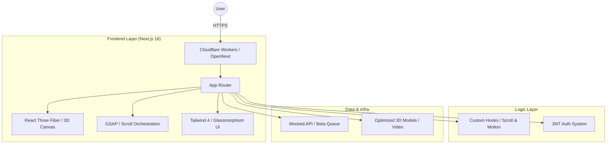
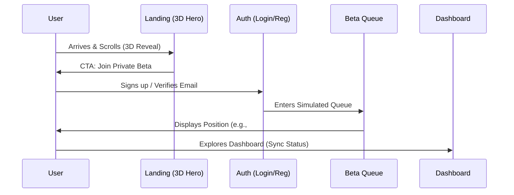

# <p align="center">🖋️ PenFlow — Smart Pen Ecosystem</p>

<p align="center">
  
  
  
  
  
</p>

<p align="center">
  <strong>"Write. Think. Evolve."</strong><br />
  A premium, Apple-level product demonstration for a smart pen ecosystem, blending high-end hardware concepts with AI-assisted software.
</p>

---

## 🚀 Vision & Narrative

PenFlow isn't just a pen; it's a cognitive augment. Our goal is to create a high-fidelity, interactive product demo that convincingly presents a future where physical writing is seamlessly integrated with digital intelligence.

- **Narrative**: Augmenting human thought through AI-assisted writing and instant cloud synchronization.
- **Experience**: Minimalist, motion-driven, and focused on "Apple-level" perceived quality.

---

## 🏗️ System Architecture

The application is built for the **Edge**, ensuring maximum performance and global availability.



---

## 🔄 User Journey Flow

From landing to the future of writing.



---

## 💎 3D & Motion Architecture (R3F + GSAP)

The "Hero" experience uses a unique bridge pattern to ensure buttery-smooth 60fps performance.

| Component | Responsibility |
| :--- | :--- |
| **GSAP** | Owns timelines, text reveals, and mapping scroll progress (0 → 1). |
| **R3F (useFrame)** | Owns the 3D loop. Interpolates (Lerp) towards GSAP targets for zero-jank motion. |
| **Tailwind 4** | Provides the "Glassmorphism" UI layer and ultra-fast responsive styling. |

### Motion Philosophy
- **Subtle Life**: Idle floating (±0.04y) and rotational drift.
- **Interactive Depth**: Pointer parallax reacting to mouse movement.
- **Narrative Scroll**: 3D pen rotation and camera shifts linked to scroll depth.

---

## ✨ Core Features

### 🛠️ Hardware Simulation
- **3D Hero Experience**: Immersive product showcase with cinematic lighting and materials.
- **Responsive 3D**: Optimized tier-based rendering (High/Medium/Low) for all devices.

### 🧠 AI Intelligence
- **AI Writing Assist**: Real-time suggestions for clarity and depth (Simulated).
- **Smart Sync**: Instant paper-to-cloud illusion.

### 🏢 Product Ecosystem
- **Private Beta System**: Complete onboarding flow with a simulated waiting list.
- **Focus Mode Dashboard**: A minimalist interface for distraction-free thinking.

---

## 🚦 Getting Started

### Prerequisites
- [Bun](https://bun.sh/) (Recommended)
- Cloudflare Account (for production deploy)

### Setup & Run
```bash
# Install dependencies
bun install

# Start development server
bun run dev

# Build and preview Cloudflare Worker locally
bun run build
bun run preview
```

---

## 📁 Project Structure

```text
src/
├── app/               # Next.js App Router (Landing, Auth, Beta, Dashboard)
├── components/        # UI Architecture
│   ├── hero/          # 3D Canvas, Scenes, and Scroll Logic
│   ├── product-intro/ # Narrative sections
│   └── layout/        # Glassmorphism wrappers & Navigation
├── hooks/             # useHeroTimeline, useScrollProgress, useDeviceTier
├── lib/               # Shared logic, GSAP registration, Three.js configs
└── public/            # Compressed GLB models & Optimized Assets
```

---

## 📄 Documentation Index

- 📕 [Product Requirements (PRD)](PRD_production.md)
- 📗 [Technical Specification](TECH_SPEC_production.md)
- 📘 [UI/UX & Design System](UI_SPEC_production.md)
- 📙 [Hero Implementation Playbook](HERO_IMPLEMENTATION_PLAYBOOK.md)

---

<p align="center">
  Built with ❤️ by the <strong>PenFlow Team</strong>.<br />
  <em>"The first AI-powered pen for thinkers."</em>
</p>
