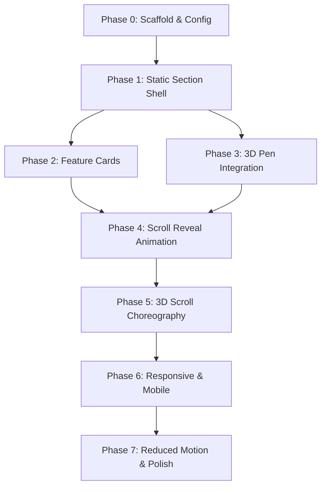

# PRODUCT INTRO IMPLEMENTATION PLAYBOOK — Smart Pen Demo

**Project:** Smart Pen Premium Demo  
**Document Type:** Implementation Playbook  
**Section:** Product Intro (Second Fold)  
**Version:** 1.0  
**Date:** 2026-04-03  
**Purpose:** Task-by-task execution plan for AI agents with limited context windows  
**Prerequisite:** Hero section fully implemented and verified

---

## 1. Executive Purpose

This playbook breaks the Product Intro section implementation into **small, logically ordered, context-safe tasks** that an AI agent can execute incrementally — one task per session.

It follows the same structure and principles as the `HERO_IMPLEMENTATION_PLAYBOOK.md`.

---

## 2. Source of Truth

The implementing agent **MUST** consult these files before any task:

| Priority | File | Purpose |
|----------|------|---------|
| 🔴 Critical | `docs/sections/product-intro/SPEC.md` | Creative direction, narrative, copy, visual rules |
| 🔴 Critical | `design-system.html` | Design tokens, colors, typography, components, motion |
| 🔴 Critical | `AGENTS.md` | Global stack rules, animation ownership, performance rules |
| 🟡 Reference | `components/hero/HeroSection.tsx` | Current hero layout — integration point |
| 🟡 Reference | `components/hero/HeroScene.tsx` | Current 3D pen scene — continuity reference |
| 🟡 Reference | `hooks/useHeroScrollProgress.ts` | Scroll progress pattern to replicate |
| 🟡 Reference | `lib/three/heroSceneConfig.ts` | Scene config pattern to replicate |
| 🟡 Reference | `PRD_production.md` | Product vision, features |
| 🟡 Reference | `UI_SPEC_production.md` | UI/UX constraints |
| 🟢 Docs | `node_modules/next/dist/docs/` | Next.js 16 App Router specifics |

---

## 3. Global Build Rules

Inherited from `HERO_IMPLEMENTATION_PLAYBOOK.md` and `AGENTS.md`. **Non-negotiable:**

- **Design System:** All colors, fonts, spacing, glass-panel from design tokens
- **Performance:** 60fps target; no React state on every frame; `useRef` + `useFrame`
- **Accessibility:** Heading hierarchy (h2/h3 in this section); keyboard CTAs; reduced motion first-class
- **Animation Ownership:** GSAP owns timelines/scroll; R3F owns per-frame 3D; one system per element
- **Separation of Concerns:** 3D separate from DOM; configs in lib files; no magic numbers
- **Mobile:** Not compressed desktop; separate intentional path
- **Code Quality:** TypeScript strict; `useGSAP`; cleanup on unmount; dynamic import R3F with `ssr: false`

---

## 4. Dependency Order



Key dependencies:
- Phase 1 must complete before anything visual
- Phase 2 and Phase 3 can proceed in parallel after Phase 1
- Phase 4 requires both 2 and 3
- All phases after 4 are sequential

---

## 5. Phase Breakdown

| Phase | Name | Goal | Tasks |
|-------|------|------|-------|
| 0 | Scaffold & Config | File structure + scene config | T0.1–T0.2 |
| 1 | Static Section Shell | Premium layout, no motion | T1.1–T1.3 |
| 2 | Feature Cards | Glass-panel cards with content | T2.1–T2.4 |
| 3 | 3D Pen Integration | Pen canvas in product-intro | T3.1–T3.3 |
| 4 | Scroll Reveal Animation | GSAP scroll-triggered card entrances | T4.1–T4.2 |
| 5 | 3D Scroll Choreography | Pen reacts to beat scroll progress | T5.1–T5.2 |
| 6 | Responsive & Mobile | Tablet + mobile adaptation | T6.1–T6.2 |
| 7 | Reduced Motion & Polish | Accessibility, cleanup, final tuning | T7.1–T7.3 |

---

## 6. Task Breakdown

### Phase 0 — Scaffold & Config

#### T0.1 — Scaffold Product Intro File Structure

- **Objective:** Create all component, hook, and config file stubs
- **Why:** Prevents ad-hoc file creation that drifts from architecture
- **Prerequisites:** Hero section completed
- **Files to create:**
  ```
  components/product-intro/ProductIntroSection.tsx
  components/product-intro/ProductIntroBridge.tsx
  components/product-intro/FeatureCard.tsx
  components/product-intro/FeatureAIWriting.tsx
  components/product-intro/FeatureSmartSync.tsx
  components/product-intro/FeatureFocusMode.tsx
  components/product-intro/ProductIntroCTA.tsx
  hooks/useProductIntroTimeline.ts
  hooks/useProductIntroScrollProgress.ts
  lib/three/productIntroSceneConfig.ts
  ```
- **Implementation notes:**
  - Each file: minimal valid export (`export default function X() { return null; }`)
  - All components: `'use client'` directive
  - Follow same pattern as hero component stubs
- **Acceptance criteria:** All files exist with valid TypeScript exports; `bun run build` passes
- **Definition of done:** Scaffold matches architecture from SPEC.md §10

#### T0.2 — Product Intro Scene Configuration

- **Objective:** Define 3D pen pose targets for each narrative beat
- **Why:** Centralizes all tunable 3D values; prevents magic numbers scattered across files
- **Prerequisites:** T0.1
- **Files affected:** `lib/three/productIntroSceneConfig.ts`
- **Implementation notes:**
  - Define pen target poses for 4 beats:
    ```ts
    export const productIntroSceneConfig = {
      beats: {
        bridge: {
          pen: { rotation: [0.15, 0.57, 0], position: [0, 0, 0] },  // +10° Y from hero end
          camera: { offset: [0, 0, 0] },
          lighting: { accent: null },
        },
        aiWriting: {
          pen: { rotation: [0.29, 0.57, 0.05], position: [0, -0.02, 0] },  // tilt forward 8°
          camera: { offset: [0, 0, -0.15] },  // slight zoom in
          lighting: { accent: { position: [0.5, 0.5, 1], color: '#ffbb33', intensity: 0.4 } },
        },
        smartSync: {
          pen: { rotation: [0.15, 0.84, 0], position: [0.04, 0, 0] },  // rotate Y +25°
          camera: { offset: [0.15, 0, 0] },  // shift right
          lighting: { accent: { position: [-1, 1, -2], color: '#00bfff', intensity: 0.5 } },
        },
        focusMode: {
          pen: { rotation: [0.1, 0.4, 0], position: [0, 0, 0] },  // centered, slight backward lean
          camera: { offset: [0, 0, 0.1] },  // pull back slightly
          lighting: { accent: null },  // dim everything except key
        },
      },
      scroll: {
        beat1Range: [0, 0.2],
        beat2Range: [0.2, 0.5],
        beat3Range: [0.5, 0.75],
        beat4Range: [0.75, 1.0],
      },
    } as const;
    ```
  - Values are approximate — will be fine-tuned during T5.2
  - Use `as const` for type inference
- **Acceptance criteria:** Config exports typed object; values match SPEC §6
- **Definition of done:** Single config file, all section 3D components import from here

---

### Phase 1 — Static Section Shell

> **Checkpoint:** Section renders with proper spacing, background, and typography — zero animation, zero 3D.

#### T1.1 — ProductIntroSection Layout Shell

- **Objective:** Build the section container with proper spacing and layering
- **Why:** Establishes spatial composition before content
- **Prerequisites:** T0.1
- **Files affected:** `components/product-intro/ProductIntroSection.tsx`, `app/page.tsx`
- **Implementation notes:**
  - Section element with `ref` for scroll triggers
  - `relative`, `overflow-hidden` (but not viewport-locked)
  - Background: `bg-[var(--color-bg)]` with subtle gradient shift
  - Section padding: `py-32` (matches design system section padding)
  - Max container: `max-w-7xl mx-auto px-6`
  - Section label tag at top: `[ 01. PRODUCT ]` micro style
  - `'use client'` component
  - Integrate into `app/page.tsx` below `<HeroSection />`
- **Acceptance criteria:** Section renders below hero; proper spacing; label visible
- **Common mistakes:** Forgetting to add to page.tsx; wrong z-index vs hero
- **Definition of done:** Empty section shell visible below hero with correct spacing

#### T1.2 — Section Divider/Bridge Visual

- **Objective:** Add visual transition between hero and product-intro
- **Why:** Prevents a harsh visual cut between sections
- **Prerequisites:** T1.1
- **Files affected:** `components/product-intro/ProductIntroSection.tsx`
- **Implementation notes:**
  - Top of section: a subtle gradient fade from hero's bottom to section bg
  - Can be a `div` with `absolute -top-32` and `bg-gradient-to-b from-transparent to-[#050a14]`
  - Or a thin horizontal rule: `h-px bg-gradient-to-r from-transparent via-[#007bff]/20 to-transparent`
  - Must feel intentional, not accidental
- **Acceptance criteria:** Smooth visual transition; no jarring color jump
- **Definition of done:** Seamless visual flow from hero to product-intro

#### T1.3 — Bridge Text Block (ProductIntroBridge)

- **Objective:** Render the "More than a pen" bridge statement
- **Why:** Signals narrative deepening from hero
- **Prerequisites:** T1.1
- **Files affected:** `components/product-intro/ProductIntroBridge.tsx`, `ProductIntroSection.tsx`
- **Implementation notes:**
  - Headline: "More than a pen." — `font-heading text-4xl md:text-5xl font-medium tracking-tight text-white`
  - Supporting text: "A new kind of writing experience — where premium hardware meets an intelligent digital layer."
  - `text-lg md:text-xl text-white/70 leading-relaxed font-light max-w-lg`
  - Centered, with generous vertical padding (`py-20` or `py-24`)
  - Can use gradient text on a keyword: "intelligent" in primary gradient
  - Structure now, animate later (Phase 4)
- **Acceptance criteria:** Text renders centered; typography matches design system; hierarchy clear
- **Definition of done:** Typographic bridge statement visible and premium

---

### Phase 2 — Feature Cards

> **Checkpoint:** All three feature cards render with correct content and glass-panel styling. Static, no motion.

#### T2.1 — FeatureCard Component (Reusable)

- **Objective:** Build reusable glass-panel feature card component
- **Why:** All three features use the same card structure; DRY
- **Prerequisites:** T1.1
- **Files affected:** `components/product-intro/FeatureCard.tsx`
- **Implementation notes:**
  - Props: `icon: ReactNode`, `label: string`, `headline: string`, `body: string`, `align?: 'left' | 'right'`
  - Glass-panel class from design system (`.glass-panel rounded-2xl p-8`)
  - Icon container: `w-14 h-14 bg-gradient-to-br from-white/10 to-transparent border border-white/10 rounded-2xl flex items-center justify-center text-[#007bff]`
  - Label (micro): `text-[10px] uppercase tracking-[0.2em] text-[#007bff]`
  - Headline: `font-heading text-xl md:text-2xl font-medium text-white tracking-tight`
  - Body: `text-base text-gray-400 leading-relaxed`
  - Group with `.group` for hover — arrow icon reveals on hover
  - No animation yet — structure only
- **Acceptance criteria:** Card renders glass-panel; all typography correct; hover works
- **Common mistakes:** Hardcoding colors; wrong glass-panel borders; missing hover shimmer
- **Definition of done:** Reusable card matches design system exactly

#### T2.2 — FeatureAIWriting

- **Objective:** Beat 2 feature layout with AI Writing content
- **Prerequisites:** T2.1
- **Files affected:** `components/product-intro/FeatureAIWriting.tsx`, `ProductIntroSection.tsx`
- **Implementation notes:**
  - Uses `FeatureCard` with:
    - Icon: sparkle/brain from Lucide (via SVG import or Heroicons)
    - Label: `AI WRITING ASSIST`
    - Headline: "Write. Refine. Evolve."
    - Body: copy from SPEC §9
  - Layout wrapper: split layout on desktop (`flex flex-col lg:flex-row gap-12 items-center`)
  - Card on one side, 3D/visual placeholder on other
  - For now, visual side can be a glass-panel placeholder div
  - Generous vertical spacing between beats (`py-20 md:py-24`)
- **Acceptance criteria:** Card renders correctly with all content; split layout on desktop
- **Definition of done:** AI Writing beat content visible and properly laid out

#### T2.3 — FeatureSmartSync

- **Objective:** Beat 3 feature layout with Smart Sync content
- **Prerequisites:** T2.1
- **Files affected:** `components/product-intro/FeatureSmartSync.tsx`, `ProductIntroSection.tsx`
- **Implementation notes:**
  - Uses `FeatureCard` with:
    - Icon: cloud/arrows from Lucide
    - Label: `SMART SYNC`
    - Headline: "Every stroke, everywhere."
    - Body: copy from SPEC §9
  - Mirror layout: card on opposite side from AI Writing (`lg:flex-row-reverse`)
  - Visual placeholder on other side
- **Acceptance criteria:** Card renders; alternated layout from Beat 2
- **Definition of done:** Smart Sync beat content visible and alternated

#### T2.4 — FeatureFocusMode + ProductIntroCTA

- **Objective:** Beat 4 feature layout + end-of-section CTA block
- **Prerequisites:** T2.1
- **Files affected:** `components/product-intro/FeatureFocusMode.tsx`, `components/product-intro/ProductIntroCTA.tsx`, `ProductIntroSection.tsx`
- **Implementation notes:**
  - FeatureFocusMode uses `FeatureCard` with:
    - Icon: target/circle from Lucide
    - Label: `FOCUS MODE`
    - Headline: "Silence the noise."
    - Body: copy from SPEC §9
  - Same split layout as AI Writing (card left, visual right)
  - ProductIntroCTA:
    - Centered, generous spacing above (`mt-24 pt-16`)
    - Primary button: same pattern as HeroCTA (`bg-[#007bff] text-white text-xs font-semibold uppercase`)
    - Microcopy below: "Limited spots available. Early access waves closing soon."
    - `text-xs text-gray-500`
- **Acceptance criteria:** Focus Mode card + CTA block render correctly
- **Definition of done:** All four beats + CTA visible in the section

---

### Phase 3 — 3D Pen Integration

> **Checkpoint:** Pen from hero canvas persists into the product-intro section. Static pose, no scroll-linked motion yet.

#### T3.1 — Extend Hero Canvas Span

- **Objective:** Make the R3F canvas span both hero and product-intro sections
- **Why:** Creates seamless visual continuity for the 3D pen
- **Prerequisites:** T1.1, hero completed
- **Files affected:** `app/page.tsx`, `components/hero/HeroSection.tsx` or a new wrapper
- **Implementation notes:**
  - **Approach A (Sticky Canvas):** Make `HeroCanvas` or a new `GlobalCanvas` `position: sticky; top: 0` within a wrapper that spans both sections
  - **Approach B (Extended parent):** Wrap both sections in a parent div; place canvas as a sibling with absolute positioning spanning full height
  - Choose the approach that minimizes changes to existing hero code
  - Canvas must be behind content: `z-index: 1`, content `z-index: 10+`
  - Pen must still be visible in product-intro section viewport
  - Verify hero behavior is NOT broken by this change
- **Acceptance criteria:** Canvas visible in hero AND scrolling into product-intro; no hero regression
- **Common mistakes:** Breaking hero scroll behavior; z-index conflicts; canvas clipping
- **Definition of done:** 3D pen visible as user scrolls past hero into product-intro

#### T3.2 — Product Intro Scroll Progress Hook

- **Objective:** `useProductIntroScrollProgress` that returns progress 0→1 for this section
- **Prerequisites:** T3.1
- **Files affected:** `hooks/useProductIntroScrollProgress.ts`
- **Implementation notes:**
  - Follow exact pattern of `useHeroScrollProgress.ts`
  - Uses `ScrollTrigger.create()` on product-intro section element
  - `start: "top bottom"` or `"top 80%"` (trigger when section enters viewport)
  - `end: "bottom top"`
  - Store in `useRef` — not state
  - `scrub: true`
  - Pass `reducedMotion` to disable
  - Export the ref for consumption by 3D scene
- **Acceptance criteria:** Progress ref updates 0→1 as section scrolls; no re-renders
- **Definition of done:** Scroll progress hook ready for scene consumption

#### T3.3 — Pass Progress to Scene

- **Objective:** Wire product-intro scroll progress into the existing HeroScene
- **Prerequisites:** T3.2
- **Files affected:** `components/hero/HeroScene.tsx` (add new prop), `HeroCanvas.tsx`, relevant parent components
- **Implementation notes:**
  - Add optional `productIntroProgressRef?: { current: number }` prop to HeroScene
  - In `useFrame`: after hero scroll logic, read product-intro progress
  - For now, just store the ref — actual pose interpolation is Phase 5
  - Do NOT break existing hero behavior
  - Default behavior when productIntroProgressRef is undefined: no change
- **Acceptance criteria:** Prop threaded through; no hero regression; build passes
- **Definition of done:** Progress ref available inside `useFrame` for Phase 5

---

### Phase 4 — Scroll Reveal Animation

> **Checkpoint:** Cards and text enter with premium scroll-triggered animations.

#### T4.1 — useProductIntroTimeline Hook

- **Objective:** GSAP scroll-triggered entrance animations for section content
- **Prerequisites:** T2.4, T0.1
- **Files affected:** `hooks/useProductIntroTimeline.ts`
- **Implementation notes:**
  - Use `useGSAP` from `@gsap/react` — NOT raw `useEffect`
  - Pass section container ref as `scope`
  - For each beat block (bridge, AI writing, smart sync, focus mode):
    - Create a `ScrollTrigger` that activates when the beat enters viewport
    - `start: "top 85%"` or `"top 80%"` — trigger before fully in view
    - Animate: opacity `0→1`, translateY `40px→0`, duration `0.8s`, easing `power2.out`
    - Stagger children within each beat: `120ms`
  - Bridge headline: split-line reveal with `80ms` stagger (same pattern as hero)
  - Icon containers: scale `0.85→1` + opacity
  - ProductIntroCTA: similar entrance, slightly delayed
  - Use CSS classes as selectors (`.feature-card`, `.bridge-headline`, etc.)
  - Cleanup on unmount via `useGSAP` scope
- **Acceptance criteria:** All cards and text enter smoothly on scroll; no FOUC; cleanup works
- **Common mistakes:** Too fast animation; forgetting reduced motion check; not using `useGSAP`
- **Definition of done:** Polished scroll-reveal for all section content

#### T4.2 — Reduced Motion Skip for Content Animation

- **Objective:** When reduced motion is enabled, make all content immediately visible
- **Prerequisites:** T4.1
- **Files affected:** `hooks/useProductIntroTimeline.ts`, `ProductIntroSection.tsx`
- **Implementation notes:**
  - If `reducedMotion`, set all animated elements to `opacity: 1`, `transform: none` immediately
  - Skip ScrollTrigger creation entirely
  - Content must be readable without any animation
- **Acceptance criteria:** All content visible immediately with reduced motion; no animation
- **Definition of done:** Reduced motion users see full content without waiting

---

### Phase 5 — 3D Scroll Choreography

> **Checkpoint:** The pen changes pose per beat, driven by scroll progress.

#### T5.1 — Beat Progress Calculation

- **Objective:** Map raw section scroll progress to individual beat progress values
- **Prerequisites:** T3.3, T0.2
- **Files affected:** `components/hero/HeroScene.tsx` or a new utility
- **Implementation notes:**
  - Given section progress `0→1`, calculate which beat is active:
    ```ts
    const beatProgress = (progress: number, start: number, end: number) => 
      clamp((progress - start) / (end - start), 0, 1);
    ```
  - Read beat ranges from `productIntroSceneConfig.scroll`
  - Compute `bridge`, `aiWriting`, `smartSync`, `focusMode` progress values
  - These drive interpolation targets in `useFrame`
- **Acceptance criteria:** Beat progress values correct; transitions smooth
- **Definition of done:** Utility to decompose section progress into beat progress

#### T5.2 — Pen Pose Interpolation Per Beat

- **Objective:** Smoothly interpolate pen rotation, position, and lighting per beat
- **Prerequisites:** T5.1
- **Files affected:** `components/hero/HeroScene.tsx`
- **Implementation notes:**
  - In `useFrame`, after existing hero logic:
  - If product-intro progress > 0:
    - Determine current beat
    - Interpolate pen toward beat target from `productIntroSceneConfig`
    - Use lerp with smooth factor
    - Optionally adjust lighting (accent light position/intensity per beat)
  - Transitions between beats: use a cross-fade progress value
  - Must blend cleanly from hero end pose to beat 1 start pose
  - Tune values empirically — config values are starting points
- **Acceptance criteria:** Pen smoothly changes pose per beat; no jumps; no jank
- **Common mistakes:** Hard snaps between beats; too much movement; forgetting lerp
- **Definition of done:** Premium pen choreography across all four beats

---

### Phase 6 — Responsive & Mobile

> **Checkpoint:** Section works across all devices.

#### T6.1 — Tablet Layout Adjustments

- **Objective:** Adapt feature cards and layout for tablet viewports
- **Prerequisites:** T2.4, hero hooks available
- **Files affected:** `ProductIntroSection.tsx`, `FeatureCard.tsx`, feature components
- **Implementation notes:**
  - Cards stack to full-width, centered
  - Remove split layout — all content stacked vertically
  - Reduce spacing: `py-16 md:py-24`
  - Pen 3D motion amplitude reduced (×0.6)
  - Typography scales down per existing responsive classes
- **Acceptance criteria:** Section looks intentional at 768px–1023px
- **Definition of done:** Tablet layout verified at 768px and 1024px

#### T6.2 — Mobile Layout & Fallback

- **Objective:** Create mobile-specific layout without 3D pen
- **Prerequisites:** T6.1
- **Files affected:** `ProductIntroSection.tsx`, feature components
- **Implementation notes:**
  - On mobile (`<768px`): hide 3D canvas for this section
  - Cards: single column, full width
  - Simplified scroll reveals: opacity only, no translateY
  - Beat headlines: `text-3xl` instead of `text-4xl md:text-5xl`
  - CTA visible early, not buried deep
  - Replace visual placeholders with simple icon-in-circle illustrations
  - Feature cards: no split layout, stacked with centered text
- **Acceptance criteria:** Section looks intentional at 375px; CTA accessible; no WebGL errors
- **Definition of done:** Mobile hero feels premium and intentional

---

### Phase 7 — Reduced Motion & Polish

> **Checkpoint:** Section is production-ready.

#### T7.1 — Full Reduced Motion Audit

- **Objective:** Verify complete reduced motion compliance
- **Prerequisites:** All prior phases
- **Files affected:** All section components and hooks
- **Implementation notes:**
  - Toggle `prefers-reduced-motion: reduce` in browser dev tools
  - Verify: all content immediately visible, no animation, pen static (or hidden)
  - CTA accessible without scrolling past animations
  - Heading hierarchy readable
- **Acceptance criteria:** Reduced motion experience feels intentional and premium
- **Definition of done:** No animation dependency for content understanding

#### T7.2 — Performance Profiling

- **Objective:** Profile and optimize section performance
- **Prerequisites:** All prior phases
- **Implementation notes:**
  - Chrome DevTools Performance tab during scroll through section
  - Target: ≥55fps on mid-range desktop
  - Check for: layout thrashing, excessive re-renders, memory leaks
  - GSAP ScrollTriggers cleaned up on unmount
  - 3D scene: check if `frameloop="demand"` needed when section not visible
  - Intersection Observer: lazy-render cards not in viewport
- **Acceptance criteria:** No scroll jank; no memory leaks; FPS stable
- **Definition of done:** Performance verified on 2+ device classes

#### T7.3 — Code Cleanup & Final Polish

- **Objective:** Clean code, verify visual quality against SPEC
- **Prerequisites:** All prior phases
- **Files affected:** All section files
- **Implementation notes:**
  - Remove debug logs, unused imports, commented-out code
  - Verify all GSAP contexts revert on unmount
  - TypeScript strict compliance
  - Review against SPEC §13 success criteria:
    1. Transition from hero seamless
    2. Each feature understood in <5 seconds
    3. 3D pen reinforces features
    4. Cards feel premium (glass-panel exact)
    5. CTA at section end feels natural
    6. Performance smooth
    7. Mobile intentional
    8. Reduced motion users get full content
    9. Users want to keep scrolling
  - Fine-tune: timing, easing, spacing, copy sizing
- **Acceptance criteria:** All 9 success criteria met
- **Definition of done:** Ship-ready product intro section

---

## 7. Context-Safe Execution Guidance

1. **Each task is self-contained.** Read only current task + prerequisites' files.
2. **Each task fits in one session.** If too large, split — never combine tasks.
3. **Restate local context before coding.** Read relevant source files and task block.
4. **Do not rewrite unrelated parts.** Only touch files listed in "files affected."
5. **Preserve prior architecture.** Never change hero component boundaries or hook signatures.
6. **Fetch library docs if uncertain.** Check GSAP, R3F, drei docs rather than guessing.
7. **Stop after one task.** Complete, validate, summarize — then stop.

---

## 8. Recommended Task Size

- **Ideal:** 50–150 lines changed per task
- **Maximum:** 200 lines across ≤3 files
- **If >200 lines:** split into sub-tasks
- **Each task:** 10–20 minutes focused work
- **Each task produces:** a verifiable, testable increment

---

## 9. Session Workflow

1. **Read** current task block from this playbook
2. **Read** only files in "prerequisites" and "files affected"
3. **Read** relevant design-system/spec sections if referenced
4. **Fetch** library docs if unfamiliar API usage
5. **Implement** only current task
6. **Validate** against acceptance criteria
7. **Stop** and summarize what was done, changed, and any issues

---

## 10. Validation Checkpoints

| Phase | Checkpoint |
|-------|-----------|
| 0 | File stubs compile; config exports typed object |
| 1 | Section renders below hero; spacing correct; label visible; gradient transition smooth |
| 2 | All 4 beats visible with cards; glass-panel matches design system; CTA at bottom |
| 3 | 3D pen visible from hero through product-intro; no hero regression |
| 4 | Cards enter with smooth scroll-reveal; reduced motion content visible immediately |
| 5 | Pen changes pose per beat; transitions smooth; no jumps between beats |
| 6 | Section intentional at 375px / 768px / 1024px / 1440px |
| 7 | 55+ fps; clean build; all 9 success criteria met |

---

## 11. Suggested Task Sequence

```
T0.1 → T0.2
  → T1.1 → T1.2 → T1.3
    → T2.1 → T2.2 → T2.3 → T2.4
    → T3.1 → T3.2 → T3.3
      → T4.1 → T4.2
        → T5.1 → T5.2
          → T6.1 → T6.2
            → T7.1 → T7.2 → T7.3
```

Phase 2 and 3 may interleave after Phase 1. All others sequential.
**Total: 20 tasks across 8 phases.**

---

## 12. Risk Areas

| Risk | Likelihood | Impact | Mitigation |
|------|-----------|--------|------------|
| Hero canvas extension breaks hero | High | Critical regression | Test hero behavior after every T3.x task |
| Pen pose transitions between beats are jarring | High | Breaks premium feel | Heavy lerp; tune empirically; start subtle |
| ScrollTrigger conflicts between hero and product-intro | Medium | Broken scroll | Use unique trigger names; test overlap |
| Feature cards look generic | Medium | Loses premium feel | Follow design system glass-panel exactly |
| Too much content per beat | Medium | Visual fatigue | One card per beat; strict copy limits |
| Mobile fallback feels empty | Medium | Loss of engagement | CSS illustrations or subtle animated shapes |
| Performance regression from extended canvas | Low | FPS drops | Profile; frameloop="demand" when idle |

---

## 13. Agent Operating Rules

1. **Never implement multiple phases at once**
2. **Never change hero architecture** — hero is complete and frozen
3. **Never break hero behavior** — verify after every Phase 3 task
4. **Never ignore design-system tokens** — every color, font, spacing from design system
5. **Never use undocumented assumptions** — fetch library docs if unsure
6. **Prefer small, verified changes** over large speculative ones
7. **Always check reduced motion** when adding any animation
8. **Always use `useGSAP`** from `@gsap/react` — never raw `useEffect` for GSAP
9. **Always use `useRef` + `useFrame`** for per-frame 3D updates — never `useState`
10. **Always clean up** — GSAP contexts revert, listeners removed, no memory leaks

---

## 14. Final Deliverable Mapping

| Phase | Deliverable |
|-------|------------|
| Phase 0 | Scaffolded files with scene configuration |
| Phase 1 | Premium static section shell with bridge text |
| Phase 2 | Glass-panel feature cards with all content |
| Phase 3 | 3D pen visible in product-intro section |
| Phase 4 | Smooth scroll-reveal animations for all content |
| Phase 5 | Pen choreography responding to beat scroll progress |
| Phase 6 | Responsive section across all device sizes |
| Phase 7 | Ship-ready, performant, premium product intro section |

**Final result:** A seamless continuation of the hero experience that introduces the Smart Pen's three core value pillars through scroll-driven storytelling with persistent 3D pen integration — premium at every breakpoint and accessibility mode.
